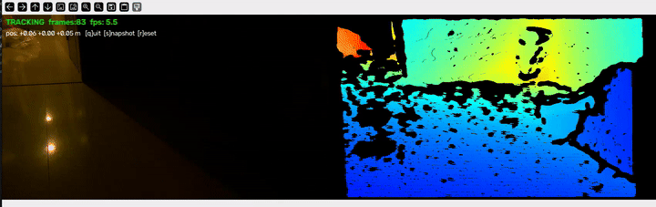
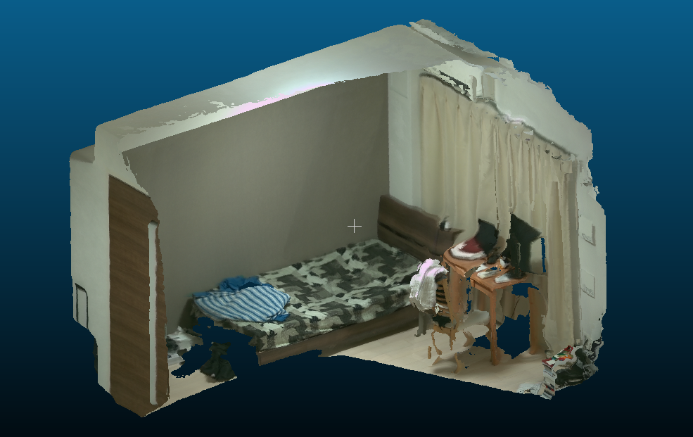

# D455 Scanner — Realtime RGB-D Point Cloud Scanner

Handheld realtime 3D reconstruction with an Intel RealSense **D455**:
dense RGB-D SLAM (KinectFusion-style frame-to-model tracking, with a gyro
rotation prior and keyframe relocalization) fused into a scalable TSDF
volume with Open3D, exported as a colored point cloud.

Two-phase pipeline, like phone scanner apps:

1. **Capture** — realtime tracking + coarse fusion while every frame is
   recorded to disk by a background writer.
2. **Offline** — the trajectory is optimized with a keyframe **pose graph**
   (loop closures remove accumulated drift), then all frames are re-fused
   at finer (4 mm) voxels, de-noised, and saved with standard 8-bit RGB
   that any viewer (MeshLab, CloudCompare, web) displays.

## Demo


*Live preview: color + depth feed with tracking status, frame count, and FPS.*



## Requirements

- Python 3.9+ with `open3d >= 0.18`, `pyrealsense2`, `opencv-python`, `numpy`
  (this repo carries a ready `venv/`)
- Intel RealSense D455 on USB 3
- CPU-only works; CUDA is auto-detected and used if the Open3D build has it

## Run

```bash
./venv/bin/python realtime_pointcloud.py        # or: ./venv/bin/python -m scanner
```

Optionally install as a command: `./venv/bin/pip install -e .` then `d455-scan`.

A window shows the live color + depth feed with tracking status. Move the
camera **slowly** around the scene, keeping previously seen geometry in view.

| Key | Action |
|-----|--------|
| `q` / `ESC` | finish scan and save `scan.ply` |
| `s` | save an intermediate snapshot |
| `r` | reset the reconstruction (clears recorded frames too) |

## Useful options

```text
--output scan.ply       output file
--depth-max 3.0         capture radius in meters (keep <= 4 on the D455)
--refine-voxel 0.004    refinement voxel size; 0.003 for max detail
--no-refine             skip refinement (faster, lower quality)
--no-posegraph          skip trajectory optimization before refinement
--refine-only DIR       re-run the offline pipeline on a saved scan_frames/
--keep-frames           keep recorded RGB-D frames (scan_frames/)
--no-imu                disable the gyro rotation prior
--temporal-filter       enable the temporal depth filter (off by default:
                        it ghosts on a moving handheld camera)
--keep-auto-exposure    don't freeze exposure/white balance after warm-up
--kf-every 15           keyframe interval (pose graph + relocalization)
--kf-trans 0.10         extra keyframe after this much translation (m)
--kf-rot 10.0           extra keyframe after this much rotation (deg)
--mesh                  also export a triangle mesh (scan.mesh.ply)
--no-view               skip the 3D viewer at the end
--headless              no preview window (use --max-frames or Ctrl+C)
```

Run `--help` for the full list.

## Outputs

| File | Content |
|------|---------|
| `scan.ply` | the colored point cloud (uchar RGB) |
| `scan.trajectory.npy` | (N, 4, 4) optimized camera-to-world poses |
| `scan.meta.json` | intrinsics, depth scale, capture parameters |
| `scan_frames/` | recorded frames + `meta.json` + `poses.npy` (kept with `--keep-frames`, always kept after a crash) |

## Crash recovery / reprocessing

Every tracked frame and pose is flushed to `scan_frames/` as you scan. If a
session crashes — or you want to retry refinement with different settings —
rebuild the cloud offline without the camera:

```bash
./venv/bin/python realtime_pointcloud.py --refine-only scan_frames --output scan.ply
```

## Project layout

```
realtime_pointcloud.py   thin CLI entry point (backwards compatible)
scanner/
├── cli.py               argument parsing, main()
├── config.py            tuning constants (documented inline)
├── camera.py            RealSense streaming, depth filters, exposure lock
├── imu.py               gyro stream + rotation-prior integration
├── capture.py           realtime capture session (tracking loop, HUD)
├── tracking.py          RGBD odometry helpers (shared by all trackers)
├── posegraph.py         keyframe selection + trajectory optimization
├── mapping.py           TSDF integration and point-cloud export
├── pipeline.py          offline refine pass, --refine-only mode
├── frameio.py           background frame writer, frame/metadata I/O
└── transforms.py        small SO(3) helpers (slerp interpolation)
```

## How it works

**Tracking.** Each frame is tracked against a raycast of the TSDF model
(frame-to-model odometry). The D455's gyro is integrated between video
frames into a rotation prior that seeds the odometry (`--no-imu` to
disable). A result is rejected when fitness is low, RMSE is high, or the
per-frame motion is implausible; after 10 consecutive lost frames the
scanner relocalizes against a ring buffer of recent keyframes instead of
the stale raycast.

**Depth.** Depth is filtered (disparity → spatial → optional temporal →
depth) on the *original* frames before depth-to-color alignment, then
clipped to `[--depth-min, --depth-max]`. Exposure and white balance are
frozen after warm-up so TSDF colors stay consistent.

**Offline.** Keyframes are selected by interval and motion thresholds.
Odometry edges connect consecutive keyframes; loop-closure edges (marked
uncertain) are added where keyframe pairs are spatially close but
temporally distant and RGBD odometry confirms the match. The graph is
optimized with `GlobalOptimizationLevenbergMarquardt`, corrections are
interpolated onto all in-between frames (slerp rotation / lerp
translation), and every frame is re-integrated at `--refine-voxel`.

## Tuning

Constants live in [`scanner/config.py`](scanner/config.py) with docstrings.
Start with these, in order:

1. **Loop closures** — `LOOP_RADIUS_M`, `LOOP_MIN_GAP_FRAMES`,
   `LOOP_FITNESS_MIN`: a *false* loop closure hurts more than a missed one,
   so loosen the radius / fitness only while watching the result.
2. **`RMSE_MAX`** — set conservatively at 0.08; if your scans typically
   report inlier RMSE around 0.01–0.05, tighten toward 0.05.
3. **Keyframe density** — `--kf-every/--kf-trans/--kf-rot` drive both pose
   graph quality and relocalization coverage; denser keyframes help scenes
   with fast motion at the cost of offline time.
4. **`GYRO_MAX_PRIOR_DEG`** — raise it if fast intentional rotations get
   their prior discarded.

## Scanning tips

- Move slowly and smoothly; rotation-only motion is the easiest way to lose
  tracking. Translate while rotating.
- If the HUD shows **LOST**, move back to where you last had tracking; after
  a few seconds it will also try to relocalize automatically.
- Close a loop when you can (return to where you started) — that's what the
  pose graph uses to cancel drift.
- Textured, well-lit scenes track best; avoid pointing at blank walls.
- Depth beyond `--depth-max` is discarded, so only the vicinity is captured.

## Low-RAM notes

Designed to run in ~7 GB RAM: modest voxel-block budget (`--block-count`),
uint16 weight/color attributes in the refine grid, the realtime volume is
freed before the fine one is allocated, and offline frames are streamed
from disk with a small keyframe cache.

## Why not SfM/MVS?

SfM + MVS recovers depth from RGB images alone — needed when you have no
depth sensor. The D455 measures depth directly, so RGB-D SLAM + TSDF fusion
gives denser, metrically-scaled results in realtime instead of offline.
